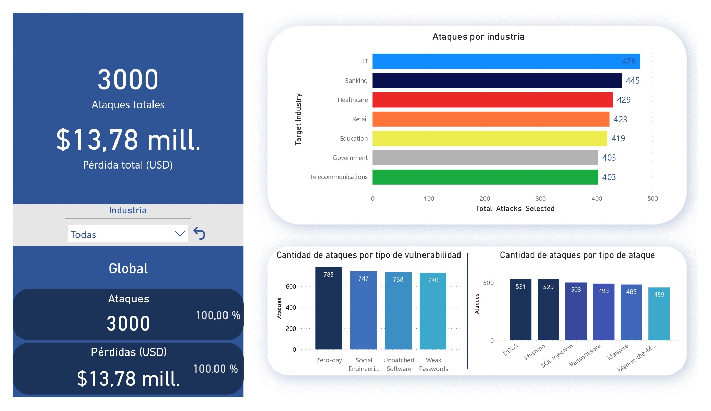

# Cybersecurity Threats Analytics Dashboard 📊🔐

An interactive Power BI dashboard analyzing global cybersecurity attacks across industries (2015–2024).

## 🔍 Project Overview

This project explores how hackers target companies and what vulnerabilities they exploit. Using a dataset from Kaggle, I've built a Power BI dashboard that allows users to:

- Filter attacks by industry.
- View total number of attacks and financial losses.
- Analyze trends in types of attacks and vulnerabilities.

## 🧰 Tools & Technologies

- Power BI

## 🗂 Dataset

- **Source:** [Global Cybersecurity Threats 2015–2024 (Kaggle)](https://www.kaggle.com/datasets/atharvasoundankar/global-cybersecurity-threats-2015-2024)
- The original `.csv` file is included in the repository.

## 📊 Dashboard Features

- Interactive filter by industry.
- KPIs: number of attacks, financial loss.
- Breakdown of vulnerabilities and attack methods.

## NOTE
The project is still in progress. I may change or add things in the future.
